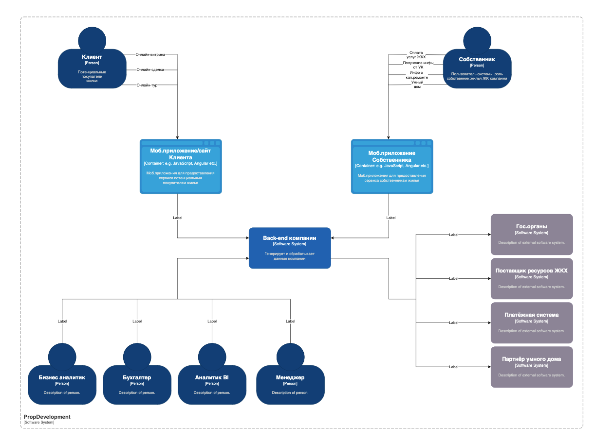

### Задание 3. Внешние интеграции:

В директории Task3  должны быть диаграмма контекста, 
обновлённая диаграмма контейнеров и список требований для внешних интеграций.

1. Подготовьте диаграмму контекста в модели С4. Она должна отражать контекст, в котором будут работать новые бизнес-функции.
2. Доработайте диаграмму контейнеров PropDevelopment. Отразите на ней изменения, которые вы предлагаете сделать в ландшафте систем кампании в связи с внедрением новых бизнес-функций.
3. Сформируйте список требований, которые должны удовлетворить внешние интеграции. Для этого:
* опишите требования к безопасности,
* выделите протоколы аутентификации и авторизации,
* опишите, как будет организовано взаимодействие между системами предприятия и внешней платформой.

Когда выполните задание, загрузите в директорию Task3 диаграмму контекста, обновлённую диаграмму контейнеров и список требований.

### Список требований для интеграции «Умного дома» в PropDevelopment:

## 1. Требования к безопасности
Интеграция с сервисами партнёра должна обеспечивать защиту персональных данных, отказоустойчивость и контроль доступа.

### **Защита персональных данных**
- **Шифрование данных**:
  - Все передаваемые данные (видео, биометрия, номера авто) должны быть зашифрованы с использованием **TLS 1.3**.
  - Данные, хранящиеся в БД, должны быть зашифрованы по стандарту **AES-256**.
- **Минимизация передаваемых данных**:
  - Передавать только **необходимую информацию** (например, хэш биометрии вместо оригинального изображения).
  - Исключить передачу **избыточных или чувствительных данных** без явного запроса.
- **Обезличивание и анонимизация**:
  - Хранение биометрических данных должно проходить через **хэширование и токенизацию**.
  - В отчётах и логах **не хранить открытые персональные данные**.

### **Защита от несанкционированного доступа**
- **Контроль доступа**:
  - Доступ к интеллектуальным устройствам только через **авторизованных пользователей**.
  - Операции по управлению дверями/шлагбаумом должны **логироваться и проверяться**.
- **Защита от атак**:
  - Реализовать защиту от **Brute Force и DoS-атак**.
  - Ограничить количество запросов к API через **Rate Limiting**.
- **Логирование и аудит**:
  - Все запросы к системам должны **логироваться** в SIEM.
  - Логи должны **храниться минимум 90 дней** и быть защищены от изменений.

---

## 2. Протоколы аутентификации и авторизации
### **Аутентификация**
- **OAuth 2.0 / OpenID Connect (OIDC)**:
  - Использовать **OAuth 2.0** для взаимодействия мобильного приложения с платформой.
  - Поддержка **PKCE (Proof Key for Code Exchange)** для защиты от атак.
  - Для взаимодействия между серверами использовать **JWT (JSON Web Token)**.
- **Многофакторная аутентификация (MFA)**:
  - Требовать MFA (например, SMS-код или Push-уведомление) для **добавления новых устройств**.

### **Авторизация**
- **Ролевая модель (RBAC)**:
  - Разделение прав для **собственников, администраторов, гостей**.
  - Собственник может **давать и отзывать доступ** для других пользователей.
- **Атрибутная модель (ABAC)**:
  - Доступ к домофону/шлагбауму может зависеть от **времени суток, геолокации, подтверждения владельца**.
- **Временные ключи доступа**:
  - Гости могут получать **разовые коды доступа** с ограниченным временем действия.

---

## 3. Организация взаимодействия между системами
Интеграция должна бесшовно работать с существующей IT-инфраструктурой PropDevelopment.

### **Общий принцип работы**
1. **Запрос доступа через мобильное приложение**  
   - Пользователь отправляет запрос на вход через **приложение PropDevelopment**.
2. **Проверка прав доступа**  
   - Система PropDevelopment проверяет **наличие разрешения в БД**.
3. **Передача команды в партнёрскую систему**  
   - После подтверждения, отправляется API-запрос **в систему партнёра**.
4. **Открытие двери/шлагбаума**  
   - Устройство **получает команду** и открывает доступ.
5. **Фиксация события в логах**  
   - Логи сохраняются как в **PropDevelopment**, так и у партнёра.

### **API-взаимодействие**
- **REST API / gRPC**:
  - Использовать REST API или gRPC для передачи данных между PropDevelopment и партнёрской платформой.
  - Все запросы должны быть **подписаны и аутентифицированы**.
- **Webhook-уведомления**:
  - В случае событий (вход, ошибка) **платформа партнёра должна отправлять уведомления** в PropDevelopment.
- **Edge computing**:
  - Для быстрой работы биометрии и распознавания номеров **обработка должна происходить на устройстве**.

### С4 Context Diagram

### С4 Containers Diagram
